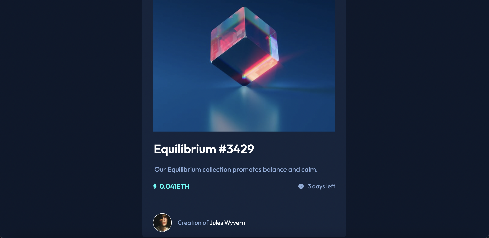
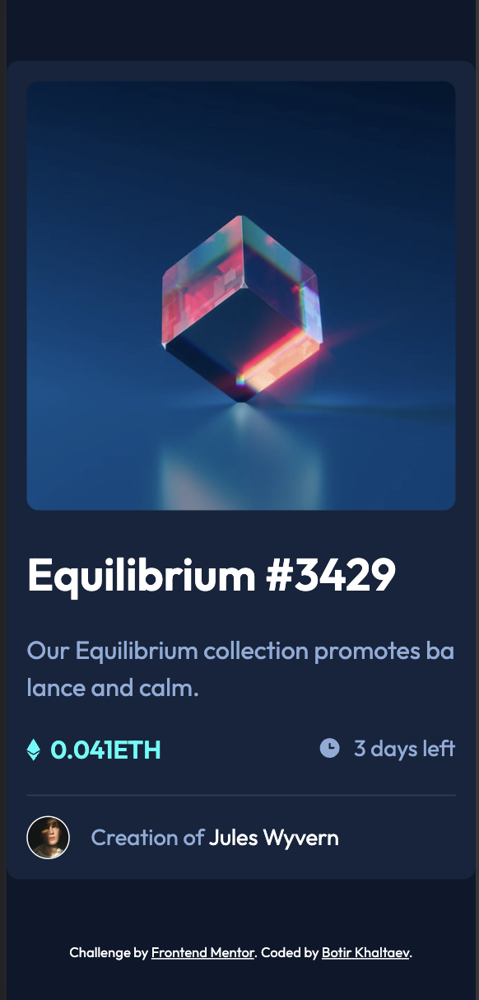

# Frontend Mentor - NFT preview card component solution

This is a solution to the [NFT preview card component challenge on Frontend Mentor](https://www.frontendmentor.io/challenges/nft-preview-card-component-SbdUL_w0U). Frontend Mentor challenges help you improve your coding skills by building realistic projects. 

## Overview

### The challenge

Users should be able to:

- View the optimal layout depending on their device's screen size
- See hover states for interactive elements

## Screenshots

## Links

- [Solution URL](https://github.com/botirk38/nft-preview-card-component-main)
- [Live Site URL](botirk38.github.io/nft-preview-card-component-main/)

## My process

### Built with

- Semantic HTML5 markup
- CSS custom properties
- Flexbox
- CSS Grid
- Mobile-first workflow

### What I learned

In this project, I learned how to create a mobile-first design and implement hover states for interactive elements. I also practiced using CSS filters to adjust brightness and CSS transitions to create smooth animations.

### Continued development

In future projects, I want to focus on improving my knowledge of responsive design techniques and exploring more advanced CSS features and animations.

## Author

- [Website](https://www.example.com)
- Frontend Mentor - [@yourusername](https://www.frontendmentor.io/profile/yourusername)
- Twitter - [@yourusername](https://www.twitter.com/yourusername)

## Acknowledgments

I would like to thank Frontend Mentor for providing this challenge and the community for their valuable feedback and support.
